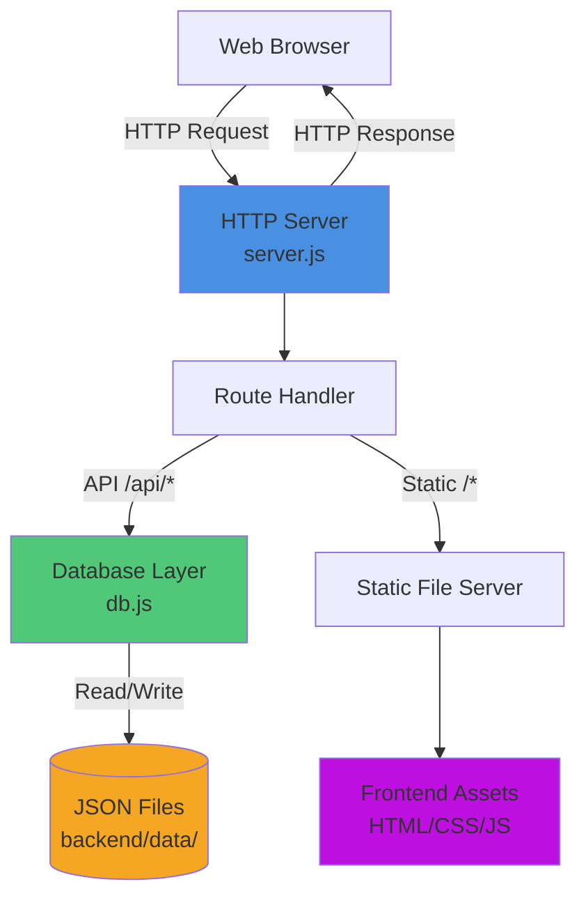
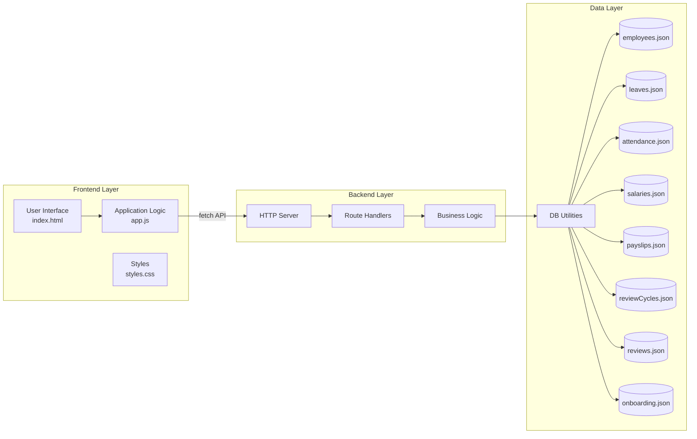

# Design Document

## Overview

Pulse is a zero-dependency HR Management Tool prototype built as a single-page application with a Node.js backend. The system implements five core HR workflows: Employee Directory & Onboarding, Leave Management, Attendance Tracking, Payroll Basics, and Performance Reviews.

### Design Goals

1. **Zero External Dependencies**: Use only Node.js built-in modules (`http`, `fs`, `path`) to eliminate setup complexity
2. **Simple Persistence**: JSON file-based storage for rapid prototyping without database installation
3. **Role-Based UI**: Dynamic interface that adapts to three user roles (HR Admin, Manager, Employee)
4. **Single Command Deployment**: Start the entire system with `node server.js` on port 4000
5. **Data Integrity**: Maintain referential relationships across entities (employees, leaves, attendance, salary, reviews)

### Technology Stack

- **Backend**: Node.js v14+ with built-in `http` module
- **Storage**: JSON files in `backend/data/` directory
- **Frontend**: Vanilla JavaScript (ES6+), HTML5, CSS3
- **API**: RESTful HTTP endpoints with JSON payloads
- **No Build Step**: Static file serving without bundlers or transpilers

---

## Architecture

### System Architecture Diagram



### Component Architecture



### Request Flow

1. **Client Request**: Browser sends HTTP request to `http://localhost:4000`
2. **Routing**: Server parses URL path and method
3. **API Handling**: For `/api/*` routes, extract parameters and parse JSON body
4. **Business Logic**: Validate input, perform operations, enforce constraints
5. **Data Access**: Read/write JSON files via `db.js` utilities
6. **Response**: Send JSON response with appropriate status code
7. **UI Update**: Frontend updates DOM based on response data

---

## Components and Interfaces

### Backend Components

#### 1. HTTP Server (`server.js`)

**Responsibilities**:
- Start HTTP server on port 4000
- Route incoming requests to appropriate handlers
- Serve static frontend files
- Handle CORS for development

**Key Functions**:

```javascript
// Start the HTTP server
function startServer(port: number): http.Server

// Route dispatcher
function handleRequest(req: http.IncomingMessage, res: http.ServerResponse): void

// Parse request body
function readBody(req: http.IncomingMessage): Promise<Object>

// Send JSON response
function sendJSON(res: http.ServerResponse, statusCode: number, data: Object): void

// Serve static files
function serveStatic(req: http.IncomingMessage, res: http.ServerResponse, urlPath: string): void
```

**Route Handlers**:

```javascript
// Employee Management
async function handleEmployees(req, res, segments): Promise<void>
  // GET /api/employees → List all employees
  // GET /api/employees/:id → Get single employee
  // POST /api/employees → Create employee
  // PUT /api/employees/:id → Update employee
  // DELETE /api/employees/:id → Remove employee

// Leave Management
async function handleLeaves(req, res, segments, query): Promise<void>
  // GET /api/leaves?employeeId=X → List leaves (filtered)
  // POST /api/leaves → Submit leave request
  // PUT /api/leaves/:id → Update leave status

// Attendance Tracking
async function handleAttendance(req, res, segments, query): Promise<void>
  // GET /api/attendance?employeeId=X&fromDate=Y&toDate=Z → List records
  // POST /api/attendance/clock-in → Clock in
  // POST /api/attendance/clock-out → Clock out

// Payroll Management
async function handleSalaries(req, res, segments): Promise<void>
  // GET /api/salaries?employeeId=X → List salary records
  // POST /api/salaries → Create salary record
  // PUT /api/salaries/:id → Update salary record

async function handlePayslips(req, res, segments, query): Promise<void>
  // GET /api/payslips?employeeId=X → List payslips
  // POST /api/payslips/generate → Generate single payslip
  // POST /api/payslips/bulk-generate → Generate for all employees

// Performance Reviews
async function handleReviewCycles(req, res, segments): Promise<void>
  // GET /api/review-cycles → List cycles
  // POST /api/review-cycles → Create cycle
  // PUT /api/review-cycles/:id/close → Close cycle

async function handleReviews(req, res, segments): Promise<void>
  // GET /api/reviews?cycleId=X&employeeId=Y → List reviews
  // POST /api/reviews/self-assessment → Submit self-assessment
  // PUT /api/reviews/:id/manager-rating → Submit manager rating

// Dashboard
function handleDashboard(req, res): Promise<void>
  // GET /api/dashboard?role=X&employeeId=Y → Get summary stats
  // For HR_Admin: Returns all metrics (total employees, pending leaves, etc.)
  // For Employee: Returns personal stats only (requires all stats including clock-in status before displaying)

// Onboarding
async function handleOnboarding(req, res, segments): Promise<void>
  // GET /api/onboarding/:employeeId → Get checklist
  // PUT /api/onboarding/:employeeId → Update checklist
```

#### 2. Database Layer (`db.js`)

**Responsibilities**:
- Abstract JSON file operations
- Generate unique IDs with prefixes
- Provide atomic read/write operations
- Handle missing or malformed files gracefully

**Key Functions**:

```javascript
// Read entire collection from JSON file
function readCollection(collection: string): Array<Object>
  // Returns: Array of objects from {collection}.json
  // Returns: [] if file doesn't exist or is malformed
  // Returns: Empty arrays silently without logging or displaying errors

// Write entire collection to JSON file
function writeCollection(collection: string, data: Array<Object>): void
  // Writes: Pretty-printed JSON with 2-space indent
  // Creates: File if it doesn't exist

// Generate next ID in sequence
function nextId(collection: string, prefix: string): string
  // Returns: Formatted ID like "E001", "L042", "S123"
  // Logic: Finds max numeric suffix in collection, increments by 1
  // Format: {prefix}{number padded to 3 digits}

// Get file path for collection
function filePath(collection: string): string
  // Returns: Absolute path to backend/data/{collection}.json
```

**Collections**:
- `employees.json` - Employee records
- `leaves.json` - Leave requests
- `attendance.json` - Daily attendance records
- `salaries.json` - Salary configurations
- `payslips.json` - Generated monthly payslips
- `reviewCycles.json` - Performance review cycles
- `reviews.json` - Individual performance reviews
- `onboarding.json` - Onboarding checklists

#### 3. Business Logic (embedded in route handlers)

**Employee Management**:

```javascript
// Validate employee data
function validateEmployee(data: Object): { valid: boolean, errors: Array<string> }
  // Check: name, email, department, designation present
  // Check: email format (basic regex)
  // Check: managerId exists if provided
  // Returns: Validation result

// Check email uniqueness
function isEmailUnique(email: string, excludeId?: string): boolean
  // Returns: true if no employee has this email (except excludeId)

// Resolve manager name
function resolveManagerName(managerId: string | null): string
  // Returns: Manager's name from employees collection
  // Returns: "—" if managerId is null
  // Returns: "Manager not found" if ID doesn't exist

// Get direct reports
function getDirectReports(managerId: string): Array<Object>
  // Returns: All employees where managerId matches
```

**Leave Management**:

```javascript
// Calculate leave balance
function calculateLeaveBalance(employeeId: string, leaveType: string, year: number): number
  // Entitlements: { "Casual Leave": 12, "Sick Leave": 12, "Earned Leave": 15 }
  // Deduct: Sum of (toDate - fromDate + 1) for approved leaves in year
  // Returns: Remaining balance

// Calculate leave days
function calculateLeaveDays(fromDate: string, toDate: string): number
  // Returns: (toDate - fromDate + 1) in days
  // Assumes: fromDate <= toDate (validated before calling)

// Check leave balance sufficient
function hasLeaveBalance(employeeId: string, leaveType: string, fromDate: string, toDate: string): boolean
  // Calculates: Required days from date range
  // Checks: Against current balance for type and year
  // Rejects: When balance is zero or would become negative
  // Returns: true if balance sufficient

**Leave Approval Workflow**:

```javascript
// Validate leave status transition
function isValidLeaveTransition(currentStatus: string, newStatus: string): boolean
  // Allowed: Pending → Approved, Pending → Rejected
  // Returns: false for other transitions or repeats

// Filter leaves by manager's direct reports
function getManagerLeaves(managerId: string): Array<Object>
  // Returns: Leave_Requests where employeeId matches direct reports
  // Filters: By employee relationship only without additional authorization checks
```
```

**Attendance Tracking**:

```javascript
// Check if clocked in today
function isClockedInToday(employeeId: string): boolean
  // Returns: true if attendance record exists for today's date

// Find open attendance record
function findOpenClockIn(employeeId: string, date: string): Object | null
  // Returns: Attendance record where clockOut is null
  // Returns: null if none found

// Calculate attendance summary
function calculateAttendanceSummary(employeeId: string, month: number, year: number): Object
  // Returns: { presentDays, absentDays, incompleteDays }
  // Present: Records with clockIn not null
  // Absent: Weekdays with no record
  // Incomplete: Records with clockIn but clockOut null

// Validate date range
function isValidDateRange(fromDate: string, toDate: string): boolean
  // Returns: false if fromDate is later than toDate
  // Applies: To all user roles including HR_Admin
```

**Payroll Management**:

```javascript
// Find active salary record
function getActiveSalary(employeeId: string, asOfDate: string): Object | null
  // Returns: Salary record with latest effectiveFrom <= asOfDate
  // Returns: null if no valid record

// Calculate net pay
function calculateNetPay(baseSalary: number, allowances: number, deductions: number): number
  // Formula: baseSalary + allowances - deductions
  // Returns: Numeric value (no rounding)

// Check payslip exists
function payslipExists(employeeId: string, month: number, year: number): boolean
  // Returns: true if payslip record exists for period

// Generate payslip
function generatePayslip(employeeId: string, month: number, year: number): Object
  // Finds: Active salary record for last day of month
  // Calculates: Net pay
  // Creates: Payslip record with generatedOn = today
  // Returns: Created payslip object
  // Throws: Error if no salary record or payslip exists
```

**Performance Reviews**:

```javascript
// Check if cycle is active
function isCycleActive(cycleId: string): boolean
  // Returns: true if cycle status is "Active"

// Check if employee is direct report
function isDirectReport(managerId: string, employeeId: string): boolean
  // Returns: true if employee's managerId matches

// Validate manager rating
function isValidRating(rating: number): boolean
  // Returns: true if rating is integer 1-5 inclusive
  // Accepts: All integers 1, 2, 3, 4, and 5

// Calculate average rating
function calculateAverageRating(cycleId: string): number | null
  // Returns: Average managerRating for "Review Complete" reviews
  // Returns: null if no completed reviews
  // Rounds: To 1 decimal place

// Display performance summary table
function renderPerformanceSummary(cycleId: string): Object
  // Returns: Table structure with headers even when no completed reviews exist
  // Shows: "No completed reviews" message in place of average rating when no reviews complete
```

### Frontend Components

#### 1. Application Controller (`app.js`)

**Responsibilities**:
- Manage session state (role, employeeId, employeeName)
- Handle navigation between views
- Coordinate API calls
- Update UI based on role permissions

**Key Functions**:

```javascript
// API wrapper
async function api(path: string, options: Object): Promise<Object>
  // Makes: Fetch request to /api{path}
  // Handles: JSON parsing and error responses
  // Returns: Response data or throws error

// Session management
function enterApp(): void
  // Sets: Current role explicitly in session (HR_ADMIN, MANAGER, or EMPLOYEE)
  // Sets: Identity (employeeId and name) in session object
  // Shows: Main application UI
  // Loads: Dashboard, employees, leaves data
  // Configures: UI visibility by role

function switchRole(): void
  // Clears: Session state
  // Shows: Role selection gate
  // Resets: UI to initial state

// Toast notifications
function showToast(message: string): void
  // Displays: Temporary notification message
  // Auto-hides: After 2.2 seconds
```

**View Loaders**:

```javascript
// Dashboard
async function loadDashboard(): Promise<void>
  // Fetches: Dashboard stats from API
  // Renders: Stat cards based on role

// Employee Directory
async function loadEmployees(): Promise<void>
  // Fetches: All employees
  // Renders: Employee table with role-appropriate actions

function renderEmployees(): void
  // Filters: Based on search and department
  // Sorts: Based on column selection
  // Shows: Edit/remove buttons for HR Admin

// Leave Management
async function loadLeaves(): Promise<void>
  // Fetches: Leaves filtered by role and employeeId
  // Renders: Leave table with status badges

function renderLeaves(): void
  // Shows: Approve/reject buttons for pending leaves (HR/Manager)
  // Displays: Status badges (Pending/Approved/Rejected)

async function updateLeaveStatus(id: string, status: string): Promise<void>
  // Updates: Leave status via API
  // Refreshes: Leave table and dashboard

// Attendance
async function loadAttendance(): Promise<void>
  // Fetches: Attendance records for employee or all
  // Renders: Today's status and history table
  // Displays: Information regardless of whether a record exists for today
  // Shows: Message if no record exists for today's date

async function clockIn(): Promise<void>
  // Posts: Clock-in request with current time
  // Updates: UI to show clocked-in state

async function clockOut(): Promise<void>
  // Posts: Clock-out request with current time
  // Updates: UI to show completed day

// Payroll
async function loadPayslips(): Promise<void>
  // Fetches: Payslips for employee or period
  // Renders: Payslip list and detail view

async function generatePayslip(employeeId: string, month: number, year: number): Promise<void>
  // Posts: Payslip generation request
  // Shows: Success/error toast
  // Refreshes: Payslip list

// Performance Reviews
async function loadReviewCycles(): Promise<void>
  // Fetches: All review cycles
  // Renders: Cycle list with status

async function loadReviews(cycleId: string): Promise<void>
  // Fetches: Reviews for cycle
  // Renders: Review table based on role

async function submitSelfAssessment(cycleId: string, assessment: string): Promise<void>
  // Posts: Self-assessment text
  // Updates: Review status
  // Refreshes: Review list

async function submitManagerRating(reviewId: string, rating: number, comments: string): Promise<void>
  // Posts: Manager rating and comments
  // Updates: Review status to complete
  // Refreshes: Review list

// Onboarding
async function loadOnboarding(employeeId: string): Promise<void>
  // Fetches: Onboarding checklist
  // Renders: Checklist with completion state

async function updateOnboardingItem(employeeId: string, itemId: string, completed: boolean): Promise<void>
  // Posts: Item completion state
  // Updates: Checklist UI
```

#### 2. UI Components (`index.html`)

**Structure**:
- Role selection gate (initial screen)
- Sidebar navigation (role-based visibility)
- Dashboard view (summary statistics)
- Employee Directory view (table with search/filter)
- Leave Management view (table with apply/approve actions)
- Attendance view (clock-in/out controls, history table)
- Payroll view (payslip list and generation)
- Performance Reviews view (cycles, self-assessment, manager ratings)
- Modals for forms (add employee, apply leave, self-assessment)
- Toast notification container

**Key UI Patterns**:
- Tab-based navigation in sidebar
- Table views with sortable columns
- Modal dialogs for form submission
- Stat cards for dashboard metrics
- Badge components for status display
- Action buttons with role-based visibility

---

## Data Models

### Employee Record

```javascript
{
  id: string,              // Format: "E###" (e.g., "E001", "E042")
  name: string,            // Full name, required, non-empty
  email: string,           // Email address, required, unique, basic format validation
  department: string,      // Department name, required, non-empty
  designation: string,     // Job title, required, non-empty
  managerId: string | null,// References another employee.id, null if no manager
  joiningDate: string,     // ISO 8601 date "YYYY-MM-DD", defaults to current date
  status: string           // Enum: "Active" | "Inactive", defaults to "Active"
}
```

**Constraints**:
- `id`: Generated by system, immutable, unique
- `email`: Must be unique across all employees
- `managerId`: Must reference existing employee.id or be null
- `status`: Must be "Active" or "Inactive"

### Leave Request

```javascript
{
  id: string,              // Format: "L###"
  employeeId: string,      // References employee.id, required
  employeeName: string,    // Denormalized from employee.name for display
  type: string,            // Enum: "Casual Leave" | "Sick Leave" | "Earned Leave"
  fromDate: string,        // ISO 8601 date "YYYY-MM-DD", required
  toDate: string,          // ISO 8601 date "YYYY-MM-DD", required, >= fromDate
  reason: string,          // Optional text, defaults to empty string
  status: string,          // Enum: "Pending" | "Approved" | "Rejected"
  appliedOn: string        // ISO 8601 date "YYYY-MM-DD", set to current date on creation
}
```

**Constraints**:
- `employeeId`: Must reference existing employee.id
- `type`: Must be one of the three leave types
- `fromDate <= toDate`: Enforced at API level
- `status`: Defaults to "Pending", transitions only from Pending → Approved/Rejected
- Leave days `(toDate - fromDate + 1)` must not exceed balance for type

**Leave Entitlements** (per calendar year):
- Casual Leave: 12 days
- Sick Leave: 12 days
- Earned Leave: 15 days

### Attendance Record

```javascript
{
  id: string,              // Format: "A###"
  employeeId: string,      // References employee.id, required
  date: string,            // ISO 8601 date "YYYY-MM-DD", required
  clockIn: string | null,  // Time "HH:MM" (24-hour), set on clock-in
  clockOut: string | null, // Time "HH:MM" (24-hour), set on clock-out, null when open
  status: string           // Enum: "Present" | "Absent" (Present when clockIn exists)
}
```

**Constraints**:
- `employeeId`: Must reference existing employee.id
- Unique constraint: Only one record per (employeeId, date) pair
- `clockIn`: Set when employee clocks in, immutable afterward
- `clockOut`: Initially null, set when employee clocks out

### Salary Record

```javascript
{
  id: string,              // Format: "S###"
  employeeId: string,      // References employee.id, required
  baseSalary: number,      // Base monthly salary, required, >= 0
  allowances: number,      // Total monthly allowances, >= 0, defaults to 0
  deductions: number,      // Total monthly deductions, >= 0, defaults to 0
  effectiveFrom: string    // ISO 8601 date "YYYY-MM-DD", required
}
```

**Constraints**:
- `employeeId`: Must reference existing employee.id
- `baseSalary >= 0`: Non-negative
- `allowances >= 0`: Non-negative
- `deductions <= baseSalary + allowances`: Cannot exceed gross pay
- Multiple records per employee allowed (historical tracking)
- Rejection: Occurs when either baseSalary OR allowances is negative

### Payslip

```javascript
{
  id: string,              // Format: "P###"
  employeeId: string,      // References employee.id, required
  month: number,           // Integer 1-12, required
  year: number,            // 4-digit year, required
  baseSalary: number,      // Copied from active salary record
  allowances: number,      // Copied from active salary record
  deductions: number,      // Copied from active salary record
  netPay: number,          // Calculated: baseSalary + allowances - deductions
  generatedOn: string      // ISO 8601 date "YYYY-MM-DD", set to current date
}
```

**Constraints**:
- `employeeId`: Must reference existing employee.id
- Unique constraint: Only one payslip per (employeeId, month, year)
- `netPay`: Computed field, not editable
- `month`: Must be 1-12
- `year`: Must be 4-digit integer

### Review Cycle

```javascript
{
  id: string,              // Format: "RC###"
  title: string,           // Cycle name, required, non-empty
  startDate: string,       // ISO 8601 date "YYYY-MM-DD", required
  endDate: string,         // ISO 8601 date "YYYY-MM-DD", required, >= startDate
  status: string           // Enum: "Active" | "Closed", defaults to "Active"
}
```

**Constraints**:
- `startDate <= endDate`: Enforced at API level
- `status`: Defaults to "Active", can transition to "Closed" once

### Review

```javascript
{
  id: string,              // Format: "R###"
  cycleId: string,         // References reviewCycle.id, required
  employeeId: string,      // References employee.id, required
  reviewerId: string | null,// References employee.id of manager, null until rated
  selfAssessment: string,  // Employee's self-assessment text
  managerRating: number | null,// Integer 1-5 inclusive, null until manager submits
  managerComments: string, // Manager's feedback text, empty until rated
  status: string           // Enum: "Self-Assessment Submitted" | "Review Complete"
}
```

**Constraints**:
- `cycleId`: Must reference existing reviewCycle.id
- `employeeId`: Must reference existing employee.id
- `reviewerId`: Must reference existing employee.id or be null
- `managerRating`: Must be integer 1-5 inclusive when present (accepts all integers 1, 2, 3, 4, 5)
- Unique constraint: Only one review per (cycleId, employeeId)
- Self-assessment submission: Can be submitted even for closed cycles (other criteria may create reviews)
- Manager rating validation: When validation fails, prevents all database updates

### Onboarding Checklist

```javascript
{
  id: string,              // Format: "O###"
  employeeId: string,      // References employee.id, required, unique
  items: Array<{
    id: string,            // Item identifier
    label: string,         // Item description
    completed: boolean     // Completion state
  }>
}
```

**Standard Items**:
1. "Send welcome email"
2. "Set up workstation"
3. "Assign system access"
4. "Schedule orientation"

**Constraints**:
- `employeeId`: Must reference existing employee.id
- One checklist per employee (created on employee addition)

---

## Correctness Properties

*A property is a characteristic or behavior that should hold true across all valid executions of a system—essentially, a formal statement about what the system should do. Properties serve as the bridge between human-readable specifications and machine-verifiable correctness guarantees.*

The Pulse HR Tool implements several computational properties that must hold across all valid inputs. These properties focus on calculations, validations, and data integrity invariants rather than UI rendering or infrastructure concerns.

### Property 1: Sorting Preserves Elements and Order

*For any* list of employees, sorting by a column should preserve all elements (no additions or removals) and maintain correct ascending or descending order based on the sort direction and column selected.

**Validates: Requirements 2.5**

### Property 2: ID Immutability in Updates

*For any* employee update request that includes an `id` field in the payload, the employee's `id` after the update SHALL remain identical to the `id` before the update, regardless of the value provided in the request payload.

**Validates: Requirements 4.4**

### Property 3: Record Retention on Employee Deletion

*For any* employee who has associated Leave_Requests, Attendance_Records, Payslips, or Reviews, when that employee is deleted, all associated records SHALL remain in the database and be retrievable by the deleted employee's `employeeId`.

**Validates: Requirements 5.3**

### Property 4: Date Range Validation

*For any* date range input (leave application or review cycle) where `fromDate` is later than `toDate`, the system SHALL reject the request with HTTP 400 and an appropriate error message.

**Validates: Requirements 7.3, 15.2**

### Property 5: Leave Balance Calculation

*For any* employee and leave type in a given calendar year, the remaining leave balance SHALL equal the annual entitlement (12 for Casual/Sick, 15 for Earned) minus the sum of `(toDate − fromDate + 1)` across all Leave_Requests where `status` is `"Approved"` and dates fall within that year; the system SHALL reject requests when balance is zero or would become negative.

**Validates: Requirements 8.2, 8.3**

### Property 6: Balance Restoration on Status Change

*For any* Leave_Request that transitions from status `"Approved"` to either `"Rejected"` or `"Pending"`, the employee's leave balance for that leave type SHALL increase by exactly `(toDate − fromDate + 1)` days.

**Validates: Requirements 8.4**

### Property 7: Attendance Summary Calculation

*For any* set of Attendance_Records for an employee in a given month, the attendance summary SHALL correctly calculate: (1) present days as the count of records where `clockIn` is not null, (2) absent days as the count of weekday dates (Monday–Friday) with no Attendance_Record, and (3) incomplete days as the count of records where `clockIn` is not null and `clockOut` is null.

**Validates: Requirements 11.5**

### Property 8: Salary Deductions Validation

*For any* Salary_Record where `deductions` exceeds `baseSalary + allowances`, the system SHALL reject the record with HTTP 400 and the message `"deductions must not exceed gross pay"`.

**Validates: Requirements 12.4**

### Property 9: Net Pay Calculation

*For any* Payslip generated from a Salary_Record with values `baseSalary`, `allowances`, and `deductions`, the computed `netPay` SHALL equal exactly `baseSalary + allowances − deductions`.

**Validates: Requirements 13.1**

### Property 10: Average Rating Calculation

*For any* Review_Cycle containing one or more Reviews with status `"Review Complete"`, the displayed average manager rating SHALL equal `sum(managerRating for all complete reviews) / count(complete reviews)` rounded to one decimal place; when no completed reviews exist, the system SHALL display table structure with headers and a "No completed reviews" message.

**Validates: Requirements 18.2, 18.3**

### Property 11: Dashboard Stats Completeness for Employees

*For any* employee viewing the dashboard, the system SHALL require all employee stats (leave balance summary, today's clock-in status, clock-out status if available, and most recent payslip net pay) to be available before displaying any stats.

**Validates: Requirements 19.3**

---

## Error Handling

### HTTP Status Codes

The system uses standard HTTP status codes to communicate operation results:

- **200 OK**: Successful GET, PUT, or POST operation that returns data
- **201 Created**: Successful resource creation (employee, leave, attendance, etc.)
- **400 Bad Request**: Invalid input (missing fields, format errors, validation failures)
- **403 Forbidden**: Authorization failure (manager attempting to rate non-direct-report)
- **404 Not Found**: Resource does not exist (employee ID, leave ID, etc.)
- **409 Conflict**: State conflict (duplicate email, already clocked in, cycle closed)
- **422 Unprocessable Entity**: Business rule violation (insufficient leave balance, no salary record)
- **500 Internal Server Error**: Server-side failure (file I/O error, unexpected exception)

### Error Response Format

All error responses return a JSON object with an `error` field:

```javascript
{
  error: string  // Human-readable error message
}
```

### Error Categories

#### 1. Validation Errors (HTTP 400)

**Missing Required Fields**:
- Message format: `"{field1}, {field2} are required"`
- Example: `"name, email, department, designation are required"`
- Triggered by: Empty or missing required fields in POST/PUT requests
- Note: All HTTP 400 responses SHALL include an error message body

**Format Errors**:
- Email: Basic regex check for `local@domain` format
- Date: Must be ISO 8601 `YYYY-MM-DD` format
- Numeric: baseSalary, allowances, deductions must be numbers

**Range Errors**:
- Date ranges: `"fromDate must not be later than toDate"`
- Numeric ranges: `"baseSalary must be >= 0"` or `"allowances must be >= 0"` (rejects when either is negative), `"deductions must not exceed gross pay"`
- Rating range: `"managerRating must be an integer between 1 and 5"` (accepts all integers 1-5 inclusive)

**Invalid References**:
- Message format: `"Invalid {field}"`
- Example: `"Invalid employeeId"`, `"Invalid managerId"`
- Triggered by: References to non-existent IDs

#### 2. Not Found Errors (HTTP 404)

**Resource Not Found**:
- Message format: `"{Resource} not found"`
- Examples: `"Employee not found"`, `"Leave request not found"`, `"Review cycle not found"`
- Triggered by: Operations on non-existent resource IDs
- Note: Employee offboarding returns HTTP 404 even after confirmation if employee doesn't exist

#### 3. Conflict Errors (HTTP 409)

**Duplicate Resources**:
- Email uniqueness: `"Email already in use"`
- Duplicate submissions: `"Already clocked in for today"`, `"Self-assessment already submitted for this cycle"`
- Duplicate payslips: `"Payslip already generated for this period"`

**State Conflicts**:
- Status transition: `"Leave request is not in Pending status"`, `"Review cycle is already closed"`
- Precondition: `"No open clock-in found for today"`, `"Review is not in Self-Assessment Submitted status"`

**Closed Cycles**:
- Message: `"Review cycle is closed"`
- Triggered by: Attempting operations on closed review cycles

#### 4. Business Rule Violations (HTTP 422)

**Insufficient Leave Balance**:
- Message: `"Insufficient leave balance for {type}"`
- Triggered by: Leave application exceeding available balance or when remaining balance is zero
- Note: Rejects requests when balance is zero or would become negative

**Missing Prerequisites**:
- Message: `"No salary record found for the requested period"`
- Triggered by: Payslip generation without active salary record

#### 5. Authorization Errors (HTTP 403)

**Access Denied**:
- Message: `"Access denied: employee is not a direct report"`
- Triggered by: Manager attempting to rate employee outside their hierarchy

#### 6. Server Errors (HTTP 500)

**File I/O Failures**:
- Message: Generic error message from exception
- Triggered by: JSON file read/write failures, permission errors
- Behavior: Server continues operation, returns error for failed request

**Unexpected Exceptions**:
- Message: `err.message` from caught exception
- Triggered by: Uncaught errors in request processing
- Behavior: Logged to console, error returned to client

### Error Handling Strategies

#### Frontend Error Handling

```javascript
// API wrapper catches and displays errors
async function api(path, options) {
  try {
    const res = await fetch(`/api${path}`, options);
    if (!res.ok) {
      const body = await res.json().catch(() => ({}));
      throw new Error(body.error || "Request failed");
    }
    return res.json();
  } catch (err) {
    showToast(err.message);  // Display user-friendly toast notification
    throw err;  // Re-throw for caller handling
  }
}
```

**Toast Notifications**:
- Displayed for all API errors
- Auto-hide after 2.2 seconds
- Red background for errors, green for success

**Form Validation**:
- Client-side: HTML5 required attributes, pattern matching
- Server-side: Complete validation as primary defense
- Strategy: Client validation improves UX, server validation ensures security

#### Backend Error Handling

```javascript
// Route handler wrapper with try-catch
const server = http.createServer(async (req, res) => {
  try {
    // Route matching and handling
    if (urlPath.startsWith("/api/employees")) {
      return await handleEmployees(req, res, segments);
    }
    // ... other routes
  } catch (err) {
    console.error("Server error:", err);
    return sendJSON(res, 500, { error: err.message });
  }
});
```

**Graceful Degradation**:
- Malformed JSON files: Return empty array, don't crash
- Missing collection files: Create on first write
- Invalid IDs in references: Display fallback text ("Manager not found")

#### Database Layer Error Handling

```javascript
function readCollection(collection) {
  const file = filePath(collection);
  if (!fs.existsSync(file)) return [];  // Missing file → empty collection
  
  try {
    const raw = fs.readFileSync(file, "utf-8");
    return raw.trim() ? JSON.parse(raw) : [];  // Empty file → empty array
  } catch (err) {
    // Silently return empty array without logging or displaying errors
    return [];  // Parse error → empty collection
  }
}
```

**Write Failures**:
- Caught at route handler level
- Returned as HTTP 500 to client
- Original data remains unchanged

**Persistence Restoration**:
- Occurs only through JSON file reloading on server restart
- Returns empty arrays silently for malformed or unreadable files

### Validation Order

For all requests, validation occurs in this order:

1. **Format Validation**: Check request body is valid JSON
2. **Required Fields**: Verify all required fields present and non-empty
3. **Type Validation**: Ensure fields have correct types (string, number, date)
4. **Format Validation**: Check date formats, email patterns, numeric ranges
5. **Reference Validation**: Verify foreign key references exist
6. **Business Rule Validation**: Check domain constraints (leave balance, salary rules)
7. **State Validation**: Verify state transitions are allowed (status changes)
8. **Authorization**: Check user has permission for operation (manager hierarchy)

Early return on first validation failure ensures clear, specific error messages.

---

## Testing Strategy

### Testing Approach

The Pulse HR Tool requires a comprehensive testing strategy that balances property-based testing for computational logic with example-based and integration testing for CRUD operations, UI interactions, and infrastructure concerns.

### Unit Tests

**Purpose**: Verify specific behaviors, edge cases, and error conditions with concrete examples.

**Scope**:
- CRUD operations (create, read, update, delete for all entities)
- Input validation (required fields, format checks, enum values)
- Error handling (specific error codes and messages)
- State transitions (leave approval, review cycle closure)
- Edge cases (missing manager, empty collections, null values)
- UI component rendering and event handling
- Session management and role-based visibility

**Framework**: Node.js built-in `assert` module or lightweight test runner (e.g., `node:test`)

**Example Test Structure**:

```javascript
// Test employee creation with valid data
async function testCreateEmployee() {
  const payload = {
    name: "John Doe",
    email: "john@example.com",
    department: "Engineering",
    designation: "Software Engineer"
  };
  const response = await api("/employees", {
    method: "POST",
    body: JSON.stringify(payload)
  });
  assert.strictEqual(response.status, "Active");
  assert.match(response.id, /^E\d{3}$/);
}

// Test missing required field
async function testCreateEmployeeInvalidMissingFields() {
  const payload = { name: "John Doe" };
  await assert.rejects(
    () => api("/employees", { method: "POST", body: JSON.stringify(payload) }),
    { message: /email.*required/ }
  );
  // Verify HTTP 400 always includes error message body
}

// Test employee offboarding returns 404 even after confirmation if employee doesn't exist
async function testOffboardNonExistentEmployee() {
  await assert.rejects(
    () => api("/employees/E999", { method: "DELETE", body: JSON.stringify({ confirmed: true }) }),
    { status: 404, message: /Employee not found/ }
  );
}

// Test manager rating accepts all integers 1-5 inclusive
async function testManagerRatingValidation() {
  for (let rating = 1; rating <= 5; rating++) {
    const response = await api(`/reviews/${reviewId}/manager-rating`, {
      method: "PUT",
      body: JSON.stringify({ managerRating: rating, managerComments: "Test" })
    });
    assert.strictEqual(response.managerRating, rating);
  }
}

// Test manager rating prevents all database updates when validation fails
async function testManagerRatingValidationFailure() {
  const originalReview = await api(`/reviews/${reviewId}`);
  await assert.rejects(
    () => api(`/reviews/${reviewId}/manager-rating`, {
      method: "PUT",
      body: JSON.stringify({ managerRating: 6, managerComments: "Invalid" })
    }),
    { status: 400 }
  );
  const unchangedReview = await api(`/reviews/${reviewId}`);
  assert.deepStrictEqual(unchangedReview, originalReview);
}
```

**Coverage Goals**:
- All API endpoints (success and error paths)
- All validation rules
- All state transitions
- All error codes and messages

### Property-Based Tests

**Purpose**: Verify universal properties hold across wide input ranges through randomized testing.

**Framework**: `fast-check` (JavaScript property-based testing library)

**Configuration**:
- Minimum 100 iterations per property test
- Each test references its design document property via comment tag
- Tag format: `// Feature: pulse-hr-tool, Property {N}: {property text}`

**Property Test Implementation**:

```javascript
const fc = require("fast-check");

// Feature: pulse-hr-tool, Property 9: Net Pay Calculation
test("net pay calculation", () => {
  fc.assert(
    fc.property(
      fc.nat(100000),  // baseSalary: 0-100000
      fc.nat(50000),   // allowances: 0-50000
      fc.nat(30000),   // deductions: 0-30000
      (baseSalary, allowances, deductions) => {
        // Arrange: Create salary record
        fc.pre(deductions <= baseSalary + allowances);  // Valid salary constraint
        
        // Act: Generate payslip
        const payslip = generatePayslip(employeeId, month, year, {
          baseSalary,
          allowances,
          deductions
        });
        
        // Assert: Verify net pay calculation
        const expectedNetPay = baseSalary + allowances - deductions;
        assert.strictEqual(payslip.netPay, expectedNetPay);
      }
    ),
    { numRuns: 100 }
  );
});

// Feature: pulse-hr-tool, Property 4: Date Range Validation
test("date range validation rejects invalid ranges", () => {
  fc.assert(
    fc.property(
      fc.date(),  // Generate random dates
      fc.date(),
      (date1, date2) => {
        // Arrange: Ensure fromDate > toDate
        const [toDate, fromDate] = [date1, date2].sort();
        fc.pre(fromDate > toDate);  // Skip if dates are valid
        
        // Act: Attempt to create leave with invalid range
        const result = createLeaveRequest({
          employeeId: "E001",
          type: "Casual Leave",
          fromDate: formatDate(fromDate),
          toDate: formatDate(toDate)
        });
        
        // Assert: Should reject
        assert.strictEqual(result.status, 400);
        assert.match(result.error, /fromDate must not be later than toDate/);
      }
    ),
    { numRuns: 100 }
  );
});

// Feature: pulse-hr-tool, Property 5: Leave Balance Calculation
test("leave balance equals entitlement minus approved days", () => {
  fc.assert(
    fc.property(
      fc.array(fc.record({  // Generate random approved leaves
        fromDate: fc.date({ min: new Date("2024-01-01"), max: new Date("2024-12-31") }),
        toDate: fc.date({ min: new Date("2024-01-01"), max: new Date("2024-12-31") }),
        type: fc.constantFrom("Casual Leave", "Sick Leave", "Earned Leave")
      })),
      (leaves) => {
        // Arrange: Create employee with approved leaves
        const employeeId = "E001";
        const year = 2024;
        const leaveType = "Casual Leave";
        const entitlement = 12;
        
        // Filter to matching type and calculate used days
        const usedDays = leaves
          .filter(l => l.type === leaveType)
          .map(l => calculateLeaveDays(l.fromDate, l.toDate))
          .reduce((sum, days) => sum + days, 0);
        
        // Act: Calculate balance
        const balance = calculateLeaveBalance(employeeId, leaveType, year);
        
        // Assert: Balance = entitlement - used
        const expectedBalance = Math.max(0, entitlement - usedDays);
        assert.strictEqual(balance, expectedBalance);
      }
    ),
    { numRuns: 100 }
  );
});
```

**Properties to Implement** (from Correctness Properties section):
1. Sorting preserves elements and order
2. ID immutability in updates
3. Record retention on employee deletion
4. Date range validation (applies to all user roles)
5. Leave balance calculation (rejects when balance is zero or negative)
6. Balance restoration on status change
7. Attendance summary calculation
8. Salary deductions validation (rejects when either baseSalary OR allowances is negative)
9. Net pay calculation
10. Average rating calculation (displays table structure even with no completed reviews)
11. Dashboard stats completeness for employees (requires all stats including clock-in status)

### Integration Tests

**Purpose**: Verify end-to-end flows, database interactions, and multi-component integration.

**Scope**:
- API endpoint integration with database layer
- Multi-step workflows (onboarding, leave approval, payslip generation)
- Role-based data filtering (manager seeing direct reports only without additional authorization checks)
- Referential integrity across collections
- Server startup and static file serving
- Dashboard aggregations across multiple collections
- Self-assessment submission for closed cycles
- Attendance view display regardless of record existence
- System persistence restoration through JSON file reloading

**Test Environment**:
- Separate test data directory (`backend/data-test/`)
- Fresh JSON files for each test suite
- Reset database state between tests

**Example Integration Test**:

```javascript
// Test complete leave application and approval workflow
async function testLeaveWorkflow() {
  // Arrange: Create employee and clock in for sufficient days
  const employee = await createEmployee({ name: "Jane", email: "jane@test.com" });
  const manager = await createEmployee({ name: "Manager", email: "mgr@test.com" });
  await updateEmployee(employee.id, { managerId: manager.id });
  
  // Act: Employee applies for leave
  const leave = await createLeave({
    employeeId: employee.id,
    type: "Casual Leave",
    fromDate: "2024-06-01",
    toDate: "2024-06-03"
  });
  assert.strictEqual(leave.status, "Pending");
  
  // Act: Manager approves leave (filters by employee relationship only without additional authorization checks)
  await updateLeaveStatus(leave.id, "Approved", { managerId: manager.id });
  
  // Assert: Leave is approved and balance updated
  const updatedLeave = await getLeave(leave.id);
  assert.strictEqual(updatedLeave.status, "Approved");
  
  const balance = await getLeaveBalance(employee.id, "Casual Leave", 2024);
  assert.strictEqual(balance, 9);  // 12 - 3 days
}

// Test self-assessment can be submitted even for closed cycles
async function testSelfAssessmentClosedCycle() {
  const cycle = await createReviewCycle({ title: "Q1 2024", startDate: "2024-01-01", endDate: "2024-03-31" });
  await closeReviewCycle(cycle.id);
  
  // Self-assessment should still be allowed (other criteria may create reviews)
  const review = await submitSelfAssessment({
    cycleId: cycle.id,
    employeeId: "E001",
    selfAssessment: "Test assessment"
  });
  assert.strictEqual(review.status, "Self-Assessment Submitted");
}

// Test attendance view displays information regardless of whether record exists
async function testAttendanceViewWithoutRecord() {
  const employeeId = "E001";
  const attendanceView = await loadAttendance(employeeId);
  
  // Should display message indicating no clock-in today, not an error
  assert.ok(attendanceView.message || attendanceView.clockIn === null);
}

// Test system persistence restoration through JSON file reloading
async function testPersistenceRestoration() {
  // Create employee
  const employee = await createEmployee({ name: "Test", email: "test@test.com" });
  
  // Restart server (simulated)
  await restartServer();
  
  // Verify data restored from JSON files only
  const restoredEmployee = await getEmployee(employee.id);
  assert.deepStrictEqual(restoredEmployee, employee);
}
```

### Smoke Tests

**Purpose**: Verify basic system functionality and configuration.

**Scope**:
- Server starts successfully on port 4000
- All static files are accessible
- Database layer initializes without errors
- Empty collections handled gracefully

**Execution**: Run before each deployment or major change

### End-to-End (E2E) Tests

**Purpose**: Verify complete user journeys through the browser.

**Framework**: Playwright or Puppeteer (optional, for full UI testing)

**Scope**:
- Role selection flow
- Employee onboarding complete workflow
- Leave application and approval
- Attendance clock-in/clock-out
- Payslip generation and viewing
- Performance review cycle

**Example E2E Flow**:
1. Open browser to `http://localhost:4000`
2. Select HR Admin role
3. Add new employee via form
4. Verify employee appears in directory table
5. Check onboarding checklist created
6. Mark checklist items complete
7. Verify persistence across page refresh

### Test Organization

```
hr-tool/
├── backend/
│   ├── tests/
│   │   ├── unit/
│   │   │   ├── employee.test.js
│   │   │   ├── leave.test.js
│   │   │   ├── attendance.test.js
│   │   │   ├── payroll.test.js
│   │   │   └── reviews.test.js
│   │   ├── property/
│   │   │   ├── calculations.test.js
│   │   │   ├── validations.test.js
│   │   │   └── invariants.test.js
│   │   ├── integration/
│   │   │   ├── workflows.test.js
│   │   │   ├── api.test.js
│   │   │   └── database.test.js
│   │   └── smoke/
│   │       └── server.test.js
├── frontend/
│   └── tests/
│       ├── unit/
│       │   ├── api.test.js
│       │   ├── session.test.js
│       │   └── ui.test.js
│       └── e2e/
│           └── workflows.test.js
```

### Test Execution

**Run All Tests**:
```bash
node --test backend/tests/**/*.test.js
node --test frontend/tests/**/*.test.js
```

**Run by Category**:
```bash
node --test backend/tests/unit/**/*.test.js
node --test backend/tests/property/**/*.test.js
node --test backend/tests/integration/**/*.test.js
```

**CI/CD Integration**:
- Run smoke tests on every commit
- Run unit + property tests on pull requests
- Run full suite (including integration) before merge
- Run E2E tests on staging environment

**Coverage Goals**

- **Unit Tests**: 80% code coverage of business logic
- **Property Tests**: 100% coverage of computational properties (all 11 properties)
- **Integration Tests**: All API endpoints and major workflows
- **Smoke Tests**: Server startup and basic connectivity
- **E2E Tests**: Critical user journeys (at least 5 complete workflows)

### Testing Best Practices

1. **Test Independence**: Each test should set up and tear down its own data
2. **Clear Names**: Test names should describe what is being tested and expected outcome
3. **Arrange-Act-Assert**: Structure tests with clear sections
4. **Minimal Mocking**: Use real database layer with test data directory
5. **Fast Execution**: Unit and property tests should run in seconds
6. **Deterministic**: Tests should produce same result on every run
7. **Comprehensive Error Testing**: Test all error paths and edge cases
8. **Property Test Preconditions**: Use `fc.pre()` to filter invalid inputs

---

## Implementation Notes

### Development Workflow

1. **Start Server**: `cd backend && node server.js`
2. **Access Application**: Open `http://localhost:4000` in browser
3. **Modify Code**: Edit files in `backend/` or `frontend/`
4. **Restart Server**: Stop (Ctrl+C) and restart to pick up backend changes
5. **Refresh Browser**: Hard refresh (Ctrl+Shift+R) to pick up frontend changes

### File Structure

```
hr-tool/
├── backend/
│   ├── server.js           # HTTP server + route handlers
│   ├── db.js               # Database utilities
│   ├── data/               # JSON file storage
│   │   ├── employees.json
│   │   ├── leaves.json
│   │   ├── attendance.json
│   │   ├── salaries.json
│   │   ├── payslips.json
│   │   ├── reviewCycles.json
│   │   ├── reviews.json
│   │   └── onboarding.json
│   └── tests/              # Backend tests
├── frontend/
│   ├── index.html          # Main HTML page
│   ├── app.js              # Application logic
│   ├── styles.css          # Styles
│   └── tests/              # Frontend tests
├── .kiro/
│   └── specs/
│       └── pulse-hr-tool/
│           ├── .config.kiro
│           ├── requirements.md
│           ├── design.md   # This document
│           └── tasks.md    # Implementation tasks (to be created)
└── README.md
```

### Data Initialization

For first-time setup or testing, seed data can be created by:

1. **Manual**: Copy sample JSON files to `backend/data/`
2. **API**: Use POST endpoints to create initial records
3. **Script**: Write initialization script to populate collections

**Sample Employee**:
```json
{
  "id": "E001",
  "name": "Alice Johnson",
  "email": "alice@pulse.com",
  "department": "Engineering",
  "designation": "Senior Software Engineer",
  "managerId": null,
  "joiningDate": "2023-01-15",
  "status": "Active"
}
```

### Security Considerations

**Current Prototype Limitations** (acceptable for prototype, not for production):

- **No Authentication**: Role selection is client-side only, no password or token
- **No Authorization Middleware**: Trust client to send correct role/identity
- **No Input Sanitization**: Basic validation only, no XSS/injection prevention
- **No Rate Limiting**: Unlimited API requests
- **No HTTPS**: Plain HTTP communication
- **No Session Management**: Client stores role in JavaScript variable
- **File System Access**: Direct JSON file access without transaction safety

**Production Migration Path**:

1. **Add Authentication**: JWT-based or session-based auth with proper login
2. **Database Migration**: Replace JSON files with PostgreSQL or MongoDB
3. **Authorization Layer**: Middleware to verify user permissions on each request
4. **Input Validation**: Sanitize all inputs, use parameterized queries
5. **HTTPS**: Deploy with SSL/TLS certificates
6. **Secrets Management**: Environment variables for sensitive configuration
7. **Audit Logging**: Track all data modifications with user attribution
8. **Concurrent Access**: Use database transactions and optimistic locking

### Performance Considerations

**Current Performance Characteristics**:

- **File I/O**: Every read/write loads/saves entire collection (fine for <1000 records)
- **In-Memory Operations**: All filtering/sorting done in-memory
- **No Caching**: Fresh reads on every API request
- **No Pagination**: Returns all records in one response

**Scalability Limits** (prototype acceptable ranges):
- Employees: <500
- Leaves: <2000
- Attendance: <10,000 records
- Concurrent Users: <10

**Production Optimizations**:

1. **Database Indexing**: Index on employeeId, date, status fields
2. **Pagination**: Limit API responses to 50-100 records per page
3. **Caching**: Redis for frequently accessed data (dashboard stats)
4. **Lazy Loading**: Load employee details on-demand, not with directory
5. **Query Optimization**: Use database joins instead of client-side resolution
6. **Connection Pooling**: Reuse database connections
7. **CDN**: Serve static assets from CDN for faster delivery

### Browser Compatibility

**Target Browsers**:
- Chrome 90+
- Firefox 88+
- Safari 14+
- Edge 90+

**Required Features**:
- ES6+ JavaScript (async/await, arrow functions, template literals)
- Fetch API
- CSS Grid and Flexbox
- HTML5 form validation

### Accessibility

**Current Implementation**:
- Semantic HTML elements (table, form, button)
- Basic keyboard navigation (tab order)
- Form labels associated with inputs

**Production Requirements**:
- ARIA labels for all interactive elements
- Screen reader tested workflows
- Keyboard shortcuts for common actions
- High contrast mode support
- Focus indicators on all interactive elements
- Alternative text for all icons and images

---

## Future Enhancements

### Phase 2 Features (Post-Prototype)

1. **Employee Self-Service Portal**
   - Update personal information
   - Download payslips as PDF
   - View leave balance history

2. **Advanced Reporting**
   - Export data to CSV/Excel
   - Custom report builder
   - Dashboard with charts and graphs

3. **Notifications**
   - Email notifications for leave approvals
   - Reminder for pending self-assessments
   - Manager notifications for direct report events

4. **Attendance Automation**
   - Integration with biometric devices
   - Automatic absent marking
   - Overtime calculation

5. **Payroll Enhancements**
   - Tax calculation and deduction
   - Benefits management
   - Direct deposit integration

6. **Performance Review Extensions**
   - 360-degree feedback
   - Goal setting and tracking
   - Skill matrix and competency framework

7. **Organization Management**
   - Department hierarchy
   - Cost center allocation
   - Multi-location support

8. **Mobile Application**
   - Native iOS and Android apps
   - Mobile clock-in with GPS
   - Push notifications

### Technical Debt to Address

1. **Replace JSON files** with proper database (PostgreSQL recommended)
2. **Add authentication** and authorization layer
3. **Implement API versioning** (/api/v1/...)
4. **Add request validation middleware** with schema validation (e.g., Joi)
5. **Centralize error handling** with custom error classes
6. **Add logging framework** (Winston or Pino) for structured logs
7. **Implement API rate limiting** to prevent abuse
8. **Add health check endpoint** for monitoring
9. **Split server.js** into modular route files
10. **Add OpenAPI/Swagger documentation** for API endpoints

---

## Conclusion

This design document provides a comprehensive blueprint for the Pulse HR Management Tool, covering architecture, components, data models, correctness properties, error handling, and testing strategy. The design prioritizes simplicity and zero dependencies for the prototype phase while maintaining clear paths to production-ready enhancements.

The identified correctness properties focus on critical calculations (leave balance, net pay, attendance summaries) and data integrity invariants (ID immutability, record retention, date validation) that must hold across all valid inputs. These properties will be validated through property-based testing with 100+ iterations each, complemented by example-based unit tests for specific scenarios and integration tests for end-to-end workflows.

Next steps: Review this design with stakeholders, proceed to implementation task breakdown in `tasks.md`, and begin development following the test-driven development approach outlined in the testing strategy.
